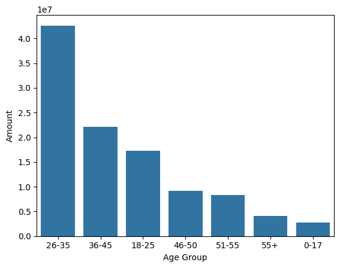
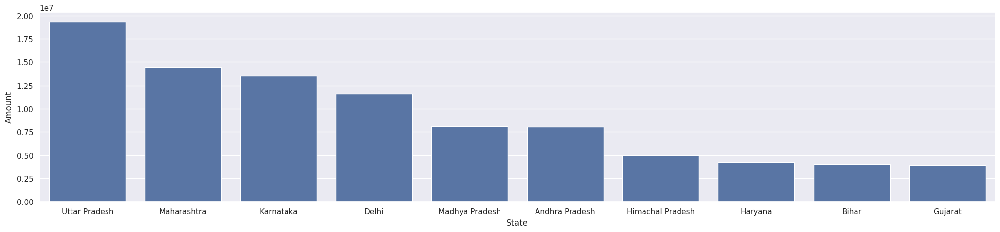

# 🪔 Diwali Sales Analysis – Python Project

This project focuses on analyzing a Diwali sales dataset to extract meaningful insights about customer behavior, product performance, and regional trends. The goal is to help businesses make data-driven decisions during festive seasons like Diwali by identifying patterns in purchases, customer segments, and high-performing product categories.

## 📁 Dataset
The dataset contains sales records of a retail business during the Diwali season, including:
- Customer ID, Age Group, Gender, and Occupation
- City, State, Marital Status
- Product Category, Product ID
- Amount Spent and Total Orders

## 🛠️ Tools & Libraries
- **Python**
- **Pandas** – for data cleaning and manipulation
- **Matplotlib** & **Seaborn** – for data visualization
- **Jupyter Notebook** – for step-by-step analysis

## 📊 Key Analysis Performed
- Cleaned missing/null values for consistent analysis.
- Explored customer segmentation by gender, age, and marital status.
- Identified top-performing product categories by revenue.
- Visualized city/state-wise performance and customer purchasing behavior.
- Provided strategic recommendations for targeted marketing.

## 💡 Business Insights
- Males aged 26–35 were the top buyers during Diwali.
- Busiest cities were New Delhi and Mumbai in terms of total orders.
- Product categories like Food, Clothing, and Electronics dominated the revenue.
- Single and married customers showed distinct purchasing preferences.

## 🔚 Outcome
The analysis helps brands focus marketing campaigns more effectively during Diwali and similar peak seasons. With clear visualizations and strategic insights, this project showcases the power of Python in business data analysis.

---

---

## 📬 Connect with Me
📧 [anshikasharma@example.com](mailto:anshikasharma@gmail.com)  
🔗 [LinkedIn](https://www.linkedin.com/in/anshika-sharma-47b393348/)

